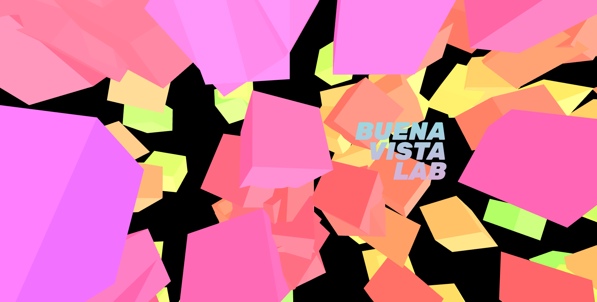

# Single Page Application Bootstrap

## A simple boilerplate to initialize a Single Page Application project

[Technologies](#floppy_disk-technologies)&nbsp;&nbsp;&nbsp;|&nbsp;&nbsp;&nbsp;[How To Use](#wrench-how-to-use)



## :floppy_disk: Technologies

This project was developed with the following technologies:

- [React](https://reactjs.org/)
- [react-slick](https://react-slick.neostack.com/)
- [Smooth Scroll](https://github.com/iamdustan/smoothscroll)
- [VS Code][vc] with [EditorConfig][vceditconfig] and [ESLint][vceslint]

## :wrench: How To Use

To clone and run this application, you'll need [Git](https://git-scm.com), [Node.js v10.16][nodejs] or higher + [Yarn v1.13][yarn] or higher installed on your computer. From your command line:

```bash
# Clone this repository
$ git clone https://github.com/buenavistalab/bvl_spa

# Go into the repository
$ cd bvl_spa

# Install dependencies
$ yarn install

# Run the app
$ yarn start
```

[nodejs]: https://nodejs.org/
[yarn]: https://yarnpkg.com/
[vc]: https://code.visualstudio.com/
[vceditconfig]: https://marketplace.visualstudio.com/items?itemName=EditorConfig.EditorConfig
[vceslint]: https://marketplace.visualstudio.com/items?itemName=dbaeumer.vscode-eslint
